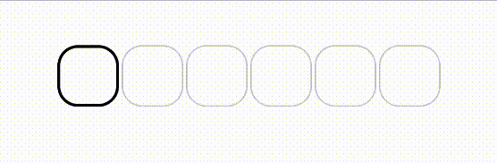

# OhTeePee 

## Demo




## Implementation

Add the Jitpack repository to your root build.gradle file. If you’re using the settings.gradle file, include it there.

```
repositories {
    ...
    maven { url 'https://jitpack.io' }
}
```

Then add OhTeePee dependency to your module build.gradle file.

```groovy
implementation "com.github.composeuisuite:ohteepee:$versionName"
```

### Usage

First of all, create a basic composable then start to build on it.

```kotlin
@Composable
fun OtpInput() {
    // a mutable state to handle OTP value changes…
    var otpValue: String by remember { mutableStateOf("") }

    // this config will be used for each cell
    val defaultCellConfig = OhTeePeeDefaults.cellConfiguration(
        borderColor = Color.LightGray,
        borderWidth = 1.dp,
        shape = RoundedCornerShape(16.dp),
        textStyle = TextStyle(
            color = Color.Black
        )
    )

    OhTeePeeInput(
        value = otpValue,
        onValueChange = { newValue, isValid ->
            otpValue = newValue
        },
        configurations = OhTeePeeDefaults.inputConfiguration(
            cellsCount = 6,
            emptyCellConfig = defaultCellConfig,
            cellModifier = Modifier
                .padding(horizontal = 4.dp)
                .size(48.dp),
        ),
    )
}
```

To customize it further, you can use config parameters such as **filledCellConfig**, **activeCellConfig**, **errorCellConfig** and **errorAnimationConfig** to create different UI behaviour for different situations.

```kotlin
@Composable
fun OtpInput() {
    ...

    OhTeePeeInput(
        ...
        configurations = OhTeePeeDefaults.inputConfiguration(
            ...,
            emptyCellConfig = defaultCellConfig,
            filledCellConfig = defaultCellConfig,
            activeCellConfig = defaultCellConfig.copy(
                borderColor = Color.Blue,
                borderWidth = 2.dp
            ),
            errorCellConfig = defaultCellConfig.copy(
                borderColor = Color.Red,
                borderWidth = 2.dp
            ),
            errorAnimationConfig = null, // default is OhTeePeeErrorAnimationConfig.Shake(),
            placeHolder = "-", // a place holder (great comment isn't it)
            divider = { index -> // Optionally, you can insert a divider between cells like e.g padding or a '-'
                Row {
                    Spacer(modifier = Modifier.width(4.dp))
                    if (index == 1) {
                        Text(" - ", color = Color.White)
                    }
                    Spacer(modifier = Modifier.width(4.dp))
                }
            },
        ),
    )
}
```

This is just the tip of the iceberg when it comes to customization of OhTeePee libray. If you want to see more, definitely check out [this article.](https://medium.com/@ilyas_ipek/d26785d53ab3)

## Todo List

- [x] Read OTP Code directly from SMS
- [x] Add animations
- [x] Write UI tests

## Authors

**Ilyas Ipek**

- Medium: <a href="https://medium.com/@ilyas_ipek" target="_blank">@ilyasipek</a>
- Github: <a href="https://github.com/ilyasipek" target="_blank">@ilyasipek</a>
- LinkedIn: <a href="https://www.linkedin.com/in/ilyas-ipek/" target="_blank">@ilyas-ipek</a>

**Tarik Yasar**

- Medium: <a href="https://medium.com/@tyasar" target="_blank">@tyasar</a>
- Github: <a href="https://github.com/tarikyasar" target="_blank">@tarikyasar</a>
- LinkedIn: <a href="https://www.linkedin.com/in/tarık-yaşar-b9438514b/" target="_blank">@tarik-yasar</a>

## Contributing

We are always open to new ideas! To contribute, please check following steps:

1. Open an issue first to discuss what you would like to change.
1. Fork the Project
1. Create your feature branch (`git checkout -b feature/new_feature`)
1. Format code using Ktlint (`./gradlew ktlintFormat`)
1. Commit your changes (`git commit -m 'Add some new feature'`)
1. Push to the branch (`git push origin feature/new_feature`)
1. Open a pull request

## Show your support

⭐️ Give us a star if this project helped you! ⭐️

### [LICENSE](https://github.com/composeuisuite/ohteepee/blob/develop/LICENSE.md)
